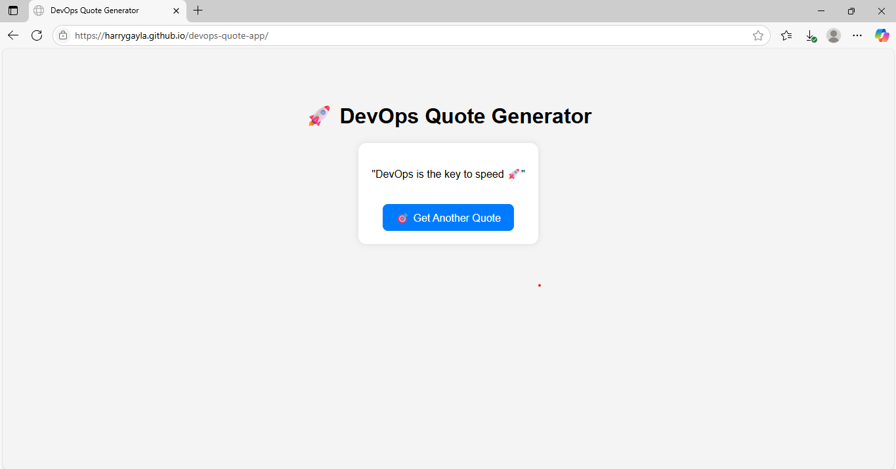

# 🚀 DevOps Quote Generator

A simple web app that serves random motivational DevOps quotes using a Node.js + Express API backend and a static frontend hosted on GitHub Pages.



## 🌐 Live Demo

- 🔗 Frontend: [https://harrygayla.github.io/devops-quote-app/](https://harrygayla.github.io/devops-quote-app/)
- 🔗 Backend API: [https://devops-quote-app-production.up.railway.app/api/quote](https://devops-quote-app-production.up.railway.app/api/quote)

---

## 📦 Tech Stack

- 💻 **Frontend**: HTML, CSS, JavaScript
- ⚙️ **Backend**: Node.js, Express
- 🌐 **Deployment**: 
  - GitHub Pages (Frontend)
  - Railway (Backend)

---

## 📸 Screenshot


---

## 🛠 Features

- 🎯 Get a random DevOps quote on page load or button click
- 🔁 Fully dynamic API-based quote fetching
- 🧩 CORS configured for frontend-backend integration

---

## 🚀 Getting Started (Local Development)

### 🖥️ Backend

```bash
# Clone the repo and go to backend folder
git clone https://github.com/your-username/devops-quote-app.git
cd devops-quote-app

# Install dependencies
npm install

# Run server
node server.js
